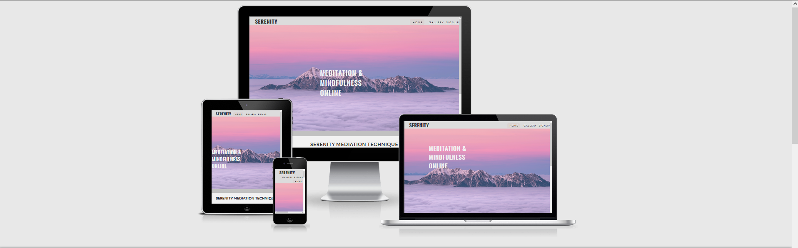
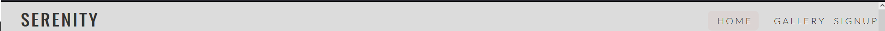
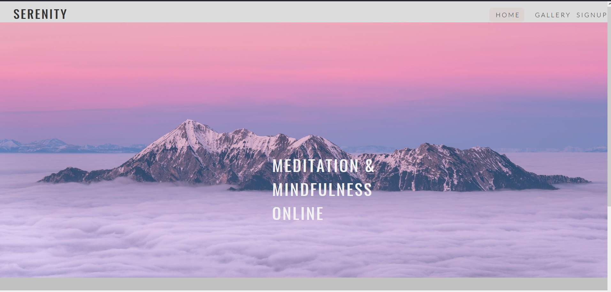
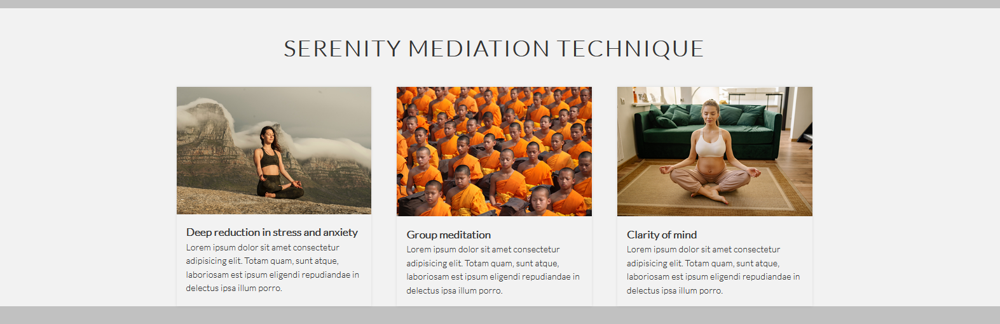
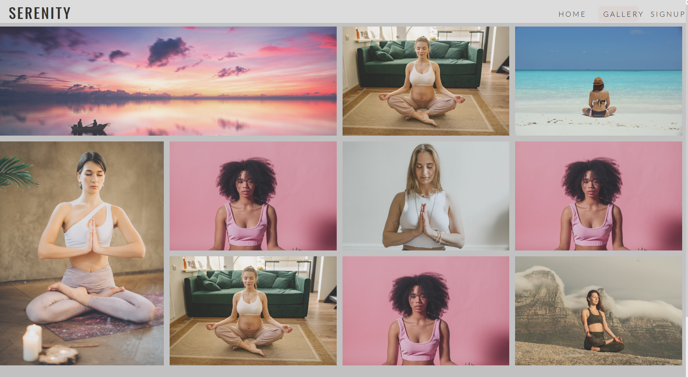
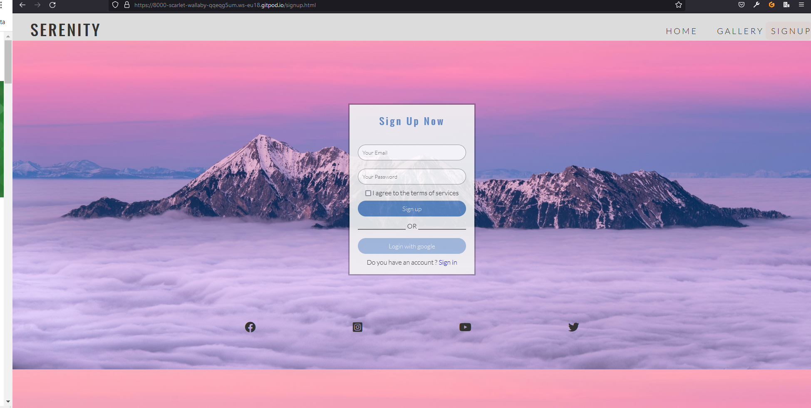

# Serenity Meditation

Serenity meditatinon is a mediation and mindfulness site. The site will be targeting people that need to calm down and live a stress-free life. Free online classes and unique mediation technique for physical and mental relaxation is available.

## Features 

In this section, you should go over the different parts of your project, and describe each in a sentence or so. You will need to explain what value each of the features provides for the user, focusing on who this website is for, what it is that they want to achieve and how your project is the best way to help them achieve these things.

### Existing Features

- __Navigation Bar__

  - Featured on all three pages, the full responsive navigation bar includes links to the Logo, Home page, Gallery and Sign Up page and is identical in each page to allow for easy navigation.
  - This section will allow the user to easily navigate from page to page across all devices without having to revert back to the previous page via the ‘back’ button. 

- __The landing page image__

  - The landing includes a photograph with text overlay to allow the user to see exactly which location this site would be applicable to. 
  - This section introduces the user to Love Running with an eye catching animation to grab their attention

- __Grid Section__

  - The club ethos section will allow the user to see the benefits of joining the Love Running meetups, as well as the benefits of running overall. 
  - This user will see the value of signing up for the Love Running meetups. This should encourage the user to consider running as their form of exercise. 

- __The Footer__ 

  - The footer section includes links to the relevant social media sites for Serenity meditatinon. The links will open to a new tab to allow easy navigation for the user. 
  - The footer is valuable to the user as it encourages them to keep connected via social media
  - The footer has some contact information to make it easy for users to get in touch with the serenity meditation club

- __Gallery__

  - The gallery will provide the user with inspirational images to motivate them to start practicing meditation.

- __The Sign Up Page__

  - - This page will allow the user to get signed up to the Serenity Meditation club to start their journey into inner peace. The user will be asked to submit their full name and    email address. 

## Testing 

- I tested that this page works in different browsers: Chrome and Firefox
- I tested that this project is responsive and functions on all screens sizes by using the dev tools device toolbar in firefox developer edition.

### Validator Testing 

- HTML
  - No errors were returned when passing through the official [W3C validator](https://validator.w3.org/nu/?doc=https%3A%2F%2Fyonastekle.github.io%2Fserenity-meditation%2F)
- CSS
  - No errors were found when passing through the official [(Jigsaw) validator](http://jigsaw.w3.org/css-validator/validator?uri=+https%3A%2F%2Fyonastekle.github.io%2Fserenity-meditation%2F&profile=css3svg&usermedium=all&warning=1&vextwarning=)

## Deployment 

- The site was deployed to GitHub pages. The steps to deploy are as follows: 
  - In the GitHub repository, navigate to the Settings tab 
  - From the source section drop-down menu, select the Master Branch
  - Once the master branch has been selected, the page will be automatically refreshed with a detailed ribbon display to indicate the successful deployment. 

The live link can be found here - https://yonastekle.github.io/serenity-meditation/

## Credits 

In this section you need to reference where you got your content, media and extra help from. It is common practice to use code from other repositories and tutorials, however, it is important to be very specific about these sources to avoid plagiarism. 

You can break the credits section up into Content and Media, depending on what you have included in your project. 

### Content 

- The text for the Home page was taken from [Lipsum](https://lipsum.com/) 
- Instructions on how to implement form the Sign Up page was taken from [How to make signupform](https://www.youtube.com/watch?v=lacpTQuE9u8&t=62s/)
- The icons in the footer were taken from [Font Awesome](https://fontawesome.com/)
- The grid layout for  gallery pages were taken from [CSS Grid Generator](https://cssgrid-generator.netlify.app/)
- Instructions on how to implement card layot for home page were taken from [CSS Grid](https://www.youtube.com/watch?v=rV67qQahXAc)

### Media

- The images in alll pages were taken from [Pexel](https://www.pexels.com/sv-se/)

